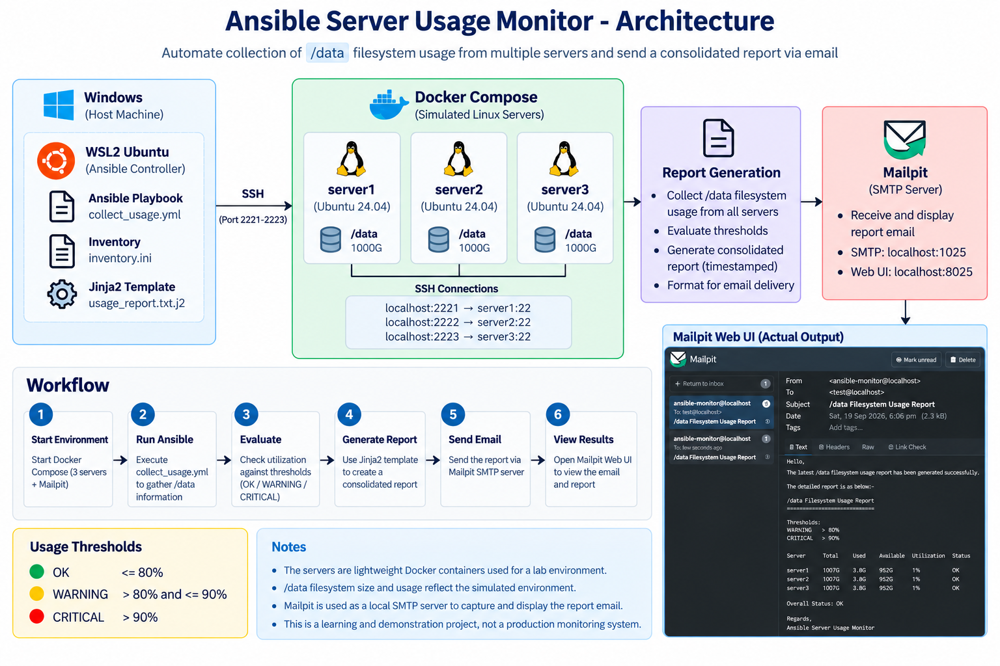
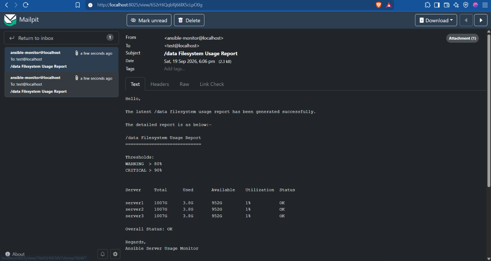

# Ansible Server Usage Monitor

## Project Overview

A hands-on DevOps automation project that uses Ansible to collect `/data` filesystem usage information from multiple simulated servers, generate a consolidated report, evaluate usage thresholds, and send the report through a simulated mail server.

The servers are simulated using Docker containers, with WSL2 Ubuntu acting as the Ansible controller.

## Project Goal

The goal is to automate the collection and reporting of filesystem information from multiple servers.

The project currently:

1. Creates three simulated Linux servers using Docker.
2. Configure Ansible to communicate with the servers over SSH.
3. Collect `/data` filesystem information from each server.
4. Determine filesystem utilization and assigns a status.
5. Generate a consolidated, timestamped report.
6. Send the report through a simulated Mailpit SMTP server.
7. Uses Git branches and development workflows to simulate a realistic engineering environment.

## Architecture

```text
Docker Containers
       |
       v
    Ansible
       |
       v
Collect /data information
       |
       v
Evaluate thresholds
       |
       v
Generate Report
       |
       v
Mailpit SMTP Server
       |
       v
Email Report
```



## Environment Architecture

```text
Windows
   |
   v
WSL2 Ubuntu
(Ansible Controller)
   |
   | SSH
   |
   +--------> server1 (Docker)
   |           localhost:2221 -> container:22
   |
   +--------> server2 (Docker)
   |           localhost:2222 -> container:22
   |
   +--------> server3 (Docker)
               localhost:2223 -> container:22

WSL2 Ubuntu
   |
   | SMTP
   v
Mailpit
localhost:1025
Web UI: localhost:8025
```

The three Docker containers simulate separate Linux servers that Ansible manages.

Each simulated server provides:

- Ubuntu 24.04-based Linux environment
- SSH access for Ansible
- An `ansible` user
- A `/data` directory used as the monitoring target

## Technologies

- Linux
- Ansible
- Docker
- Mailpit
- Git
- GitHub
- YAML
- Jinja2
- Bash

## Project Status

### Milestone 1 — Project Foundation

- [x] GitHub repository created
- [x] Local Git repository initialized
- [x] `main` branch created
- [x] `develop` branch created
- [x] Initial project structure created

### Milestone 2 — Docker Environment

- [x] Create simulated servers
- [x] Configure server filesystems
- [x] Establish networking
- [x] Verify container connectivity

### Milestone 3 — Ansible

- [x] Create Ansible inventory
- [x] Configure Ansible connectivity
- [x] Test connectivity with `ansible.builtin.ping`
- [x] Collect `/data` information
- [x] Process the collected information

### Milestone 4 — Reporting

- [x] Generate consolidated report
- [x] Add timestamp to generated reports
- [x] Evaluate filesystem utilization thresholds
- [x] Format report for email delivery

### Milestone 5 — Mail Automation

- [x] Deploy Mailpit as a simulated SMTP server
- [x] Configure mail delivery
- [x] Send generated report
- [x] Test end-to-end automation

## Repository Structure

```text
ansible-server-usage-monitor/
├── ansible/
│   ├── README.md
│   ├── inventory.ini
│   ├── playbooks/
│   │   └── collect_usage.yml
│   └── templates/
│       └── usage_report.txt.j2
├── docker/
│   ├── Dockerfile
│   ├── README.md
│   └── compose.yml
├── docs/
│   ├── architecture.png
│   └── mailpit-report.png
├── reports/
├── .gitignore
└── README.md
```

Generated files under `reports/` are excluded from Git through `.gitignore`.

## Usage Thresholds

Filesystem utilization is evaluated using the following thresholds:

```text
OK        <= 80%
WARNING   > 80% and <=90%
CRITICAL  > 90%
```

Each server receives a status in the generated report.

An overall status is also calculated for the report. A `CRITICAL` status takes precedence over `WARNING` when determining the overall status.

## Running the Project

Start the Docker environment from the project root:

```bash
docker compose -f docker/compose.yml up -d
```

Run the Ansible automation:

```bash
ansible-playbook -i ansible/inventory.ini ansible/playbooks/collect_usage.yml
```

The playbook collects `/data` filesystem information from all three simulated servers, generates a timestamped report under `reports/`, and sends the report through Mailpit.

Generated reports can be inspected with:

```bash
ls -lh reports/
```

The Mailpit web interface is available at:

```text
http://localhost:8025
```

Stop the Docker environment with:

```bash
docker compose -f docker/compose.yml down
```

## Validation

The complete Ansible workflow has been successfully validated.

A successful execution produced:

```text
PLAY RECAP
server1 : ok=5    changed=1    unreachable=0    failed=0
server2 : ok=3    changed=0    unreachable=0    failed=0
server3 : ok=3    changed=0    unreachable=0    failed=0
```

The generated report contains filesystem information and per-server status:

```text
Server     Total      Used       Available    Utilization  Status

server1    1007G      3.8G       952G         1%           OK
server2    1007G      3.8G       952G         1%           OK
server3    1007G      3.8G       952G         1%           OK

Overall Status: OK
```

Threshold behavior has also been tested independently for `OK`, `WARNING`, and `CRITICAL` conditions, including validation that a `CRITICAL` server keeps the overall report status at `CRITICAL`.

## Validation Evidence

The project was validated end-to-end:

- Docker containers are reachable through SSH.
- Ansible connectivity was verified with `ansible.builtin.ping`.
- `/data` filesystem usage was collected from all three simulated servers.
- Threshold logic was tested for `OK`, `WARNING`, and `CRITICAL` conditions.
- A consolidated report was generated using Jinja2.
- The report was delivered through Mailpit SMTP.
- The generated report was displayed in the Mailpit web interface.

### Mailpit Report

The screenshot below shows the generated `/data` filesystem usage report received by the Mailpit test mailbox.



## Git Workflow

The project uses feature branches for development:

```text
main
  ^
  |
develop
  ^
  |
feature/*
```

Feature work is developed on a dedicated feature branch, reviewed through a pull request into `develop`, and promoted to `main` at a stable milestone.

## Future Enhancements

Potential future improvements include:

- HTML email reports
- Scheduled execution
- Logging
- Error handling
- Server health checks
- Historical usage data
- Alerting based on disk utilization


The current project intentionally remains a focused automation lab rather than a production monitoring system.

